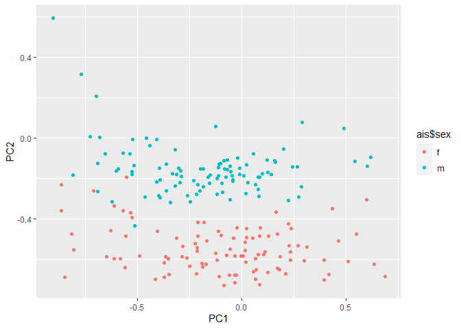

\#Script Adapted from :
<a href="https://www.r-bloggers.com/2018/07/pca-vs-autoencoders-for-dimensionality-reduction/" class="uri">https://www.r-bloggers.com/2018/07/pca-vs-autoencoders-for-dimensionality-reduction/</a>

\#Importing Required Library

``` r
library(DAAG)
```

    ## Loading required package: lattice

``` r
library(ggplot2)
library(dplyr)
```

    ## 
    ## Attaching package: 'dplyr'

    ## The following objects are masked from 'package:stats':
    ## 
    ##     filter, lag

    ## The following objects are masked from 'package:base':
    ## 
    ##     intersect, setdiff, setequal, union

``` r
library(plotly)
```

    ## 
    ## Attaching package: 'plotly'

    ## The following object is masked from 'package:ggplot2':
    ## 
    ##     last_plot

    ## The following object is masked from 'package:stats':
    ## 
    ##     filter

    ## The following object is masked from 'package:graphics':
    ## 
    ##     layout

``` r
library(FactoMineR)
library(factoextra)
```

    ## Welcome! Want to learn more? See two factoextra-related books at https://goo.gl/ve3WBa

``` r
#Define Dataset 
ais <- ais 
head(ais)
```

    ##    rcc wcc   hc   hg ferr   bmi   ssf pcBfat   lbm    ht   wt sex  sport
    ## 1 3.96 7.5 37.5 12.3   60 20.56 109.1  19.75 63.32 195.9 78.9   f B_Ball
    ## 2 4.41 8.3 38.2 12.7   68 20.67 102.8  21.30 58.55 189.7 74.4   f B_Ball
    ## 3 4.14 5.0 36.4 11.6   21 21.86 104.6  19.88 55.36 177.8 69.1   f B_Ball
    ## 4 4.11 5.3 37.3 12.6   69 21.88 126.4  23.66 57.18 185.0 74.9   f B_Ball
    ## 5 4.45 6.8 41.5 14.0   29 18.96  80.3  17.64 53.20 184.6 64.6   f B_Ball
    ## 6 4.10 4.4 37.4 12.5   42 21.04  75.2  15.58 53.77 174.0 63.7   f B_Ball

``` r
# standardise
minmax <- function(x) (x - min(x))/(max(x) - min(x))
x_train <- apply(ais[,1:11], 2, minmax)

# PCA
pca <- prcomp(x_train)

##Scree plot
fviz_screeplot(pca, ncp=10)
```


``` r
# plot cumulative plot
qplot(x = 1:11, y = cumsum(pca$sdev)/sum(pca$sdev), geom = "line")
```


``` r
ggplot(as.data.frame(pca$x), aes(x = PC1, y = PC2, col = ais$sex)) + geom_point()
```


``` r
# plot PCA in 3 dimension
#pca_plotly <- plot_ly(as.data.frame(pca$x), x = ~PC1, y = ~PC2, z = ~PC3, color = ~ais$sex) %>% add_markers()
#pca_plotly
```

``` r
# autoencoder in keras
library(keras)
# set training data
x_train <- as.matrix(x_train)
# set model
model <- keras_model_sequential()
model %>%
  layer_dense(units = 6, activation = "tanh", input_shape = ncol(x_train)) %>%
  layer_dense(units = 2, activation = "tanh", name = "bottleneck") %>%
  layer_dense(units = 6, activation = "tanh") %>%
  layer_dense(units = ncol(x_train))
# view model layers
summary(model)
```

    ## Model: "sequential"
    ## ________________________________________________________________________________
    ## Layer (type)                        Output Shape                    Param #     
    ## ================================================================================
    ## dense_2 (Dense)                     (None, 6)                       72          
    ## ________________________________________________________________________________
    ## bottleneck (Dense)                  (None, 2)                       14          
    ## ________________________________________________________________________________
    ## dense_1 (Dense)                     (None, 6)                       18          
    ## ________________________________________________________________________________
    ## dense (Dense)                       (None, 11)                      77          
    ## ================================================================================
    ## Total params: 181
    ## Trainable params: 181
    ## Non-trainable params: 0
    ## ________________________________________________________________________________

``` r
# compile model
model %>% compile(
  loss = "mean_squared_error", 
  optimizer = "adam"
)
# fit model
model %>% fit(
  x = x_train, 
  y = x_train, 
  verbose = 0,
  epochs = 1000,
  batch_size = 2
)
# evaluate the performance of the model
mse.ae2 <- evaluate(model, x_train, x_train)
mse.ae2
```

    ##       loss 
    ## 0.00873935

``` r
# extract the bottleneck layer
intermediate_layer_model <- keras_model(inputs = model$input, outputs = get_layer(model, "bottleneck")$output)
intermediate_output <- predict(intermediate_layer_model, x_train)

ggplot(data.frame(PC1 = intermediate_output[,1], PC2 = intermediate_output[,2]), aes(x = PC1, y = PC2, col = ais$sex)) + geom_point()
```



\#Seperate model with 3 nodes in the bottleneck layers

``` r
###
model3 <- keras_model_sequential()
model3 %>%
  layer_dense(units = 6, activation = "tanh", input_shape = ncol(x_train)) %>%
  layer_dense(units = 3, activation = "tanh", name = "bottleneck") %>%
  layer_dense(units = 6, activation = "tanh") %>%
  layer_dense(units = ncol(x_train))
# summar of model
summary(model3)
```

    ## Model: "sequential_1"
    ## ________________________________________________________________________________
    ## Layer (type)                        Output Shape                    Param #     
    ## ================================================================================
    ## dense_5 (Dense)                     (None, 6)                       72          
    ## ________________________________________________________________________________
    ## bottleneck (Dense)                  (None, 3)                       21          
    ## ________________________________________________________________________________
    ## dense_4 (Dense)                     (None, 6)                       24          
    ## ________________________________________________________________________________
    ## dense_3 (Dense)                     (None, 11)                      77          
    ## ================================================================================
    ## Total params: 194
    ## Trainable params: 194
    ## Non-trainable params: 0
    ## ________________________________________________________________________________

``` r
# compile model
model3 %>% compile(
  loss = "mean_squared_error", 
  optimizer = "adam"
)
# fit model
model3 %>% fit(
  x = x_train, 
  y = x_train, 
  epochs = 1000,
  verbose = 0,
  batchsize = 2
)
# evaluate the model
evaluate(model3, x_train, x_train)
```

    ##        loss 
    ## 0.006353198

``` r
# exgtract the bottleneck layer
intermediate_layer_model <- keras_model(inputs = model3$input, outputs = get_layer(model3, "bottleneck")$output)
intermediate_output <- predict(intermediate_layer_model, x_train)
# plot the reduced dat set
aedf3 <- data.frame(node1 = intermediate_output[,1], node2 = intermediate_output[,2], node3 = intermediate_output[,3])

#ae_plotly <- plot_ly(aedf3, x = ~node1, y = ~node2, z = ~node3, color = ~ais$sex) %>% add_markers()
#ae_plotly 
```

\#Comparison of Performance between PCA and Autodecoder

``` r
# PCA reconstruction
pca.recon <- function(pca, x, k){
  mu <- matrix(rep(pca$center, nrow(pca$x)), nrow = nrow(pca$x), byrow = T)
  recon <- pca$x[,1:k] %*% t(pca$rotation[,1:k]) + mu
  mse <- mean((recon - x)^2)
  return(list(x = recon, mse = mse))
}
xhat <- rep(NA, 10)
for(k in 1:10){
  xhat[k] <- pca.recon(pca, x_train, k)$mse
}
ae.mse <- rep(NA, 5)
for(k in 1:5){
  modelk <- keras_model_sequential()
  modelk %>%
    layer_dense(units = 6, activation = "tanh", input_shape = ncol(x_train)) %>%
    layer_dense(units = k, activation = "tanh", name = "bottleneck") %>%
    layer_dense(units = 6, activation = "tanh") %>%
    layer_dense(units = ncol(x_train))
  modelk %>% compile(
    loss = "mean_squared_error", 
    optimizer = "adam"
  )
  modelk %>% fit(
    x = x_train, 
    y = x_train, 
    epochs = 1000,
    verbose = 0,
    batch_size = 1,
    
  )
  ae.mse[k] <- unname(evaluate(modelk, x_train, x_train))
}
df <- data.frame(k = c(1:10, 1:5), mse = c(xhat, ae.mse), method = c(rep("pca", 10), rep("autoencoder", 5)))
ggplot(df, aes(x = k, y = mse, col = method)) + geom_line()
```


